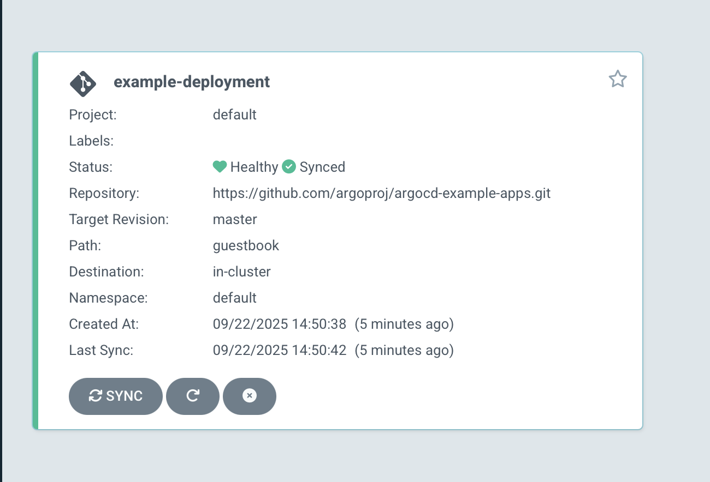
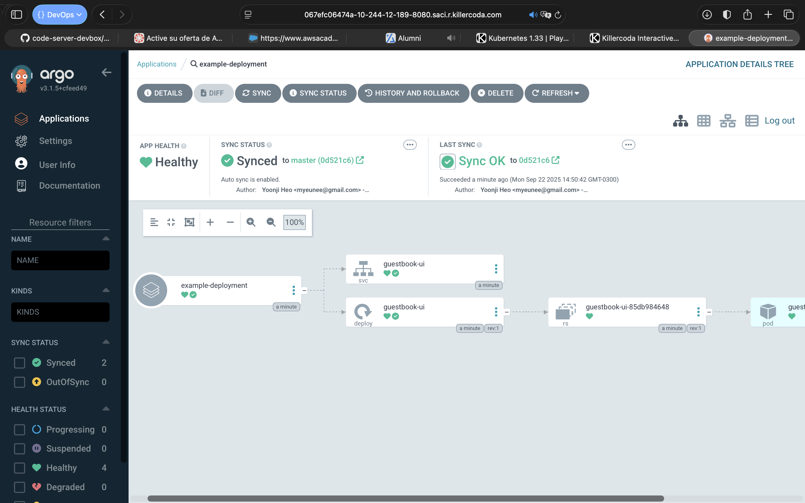
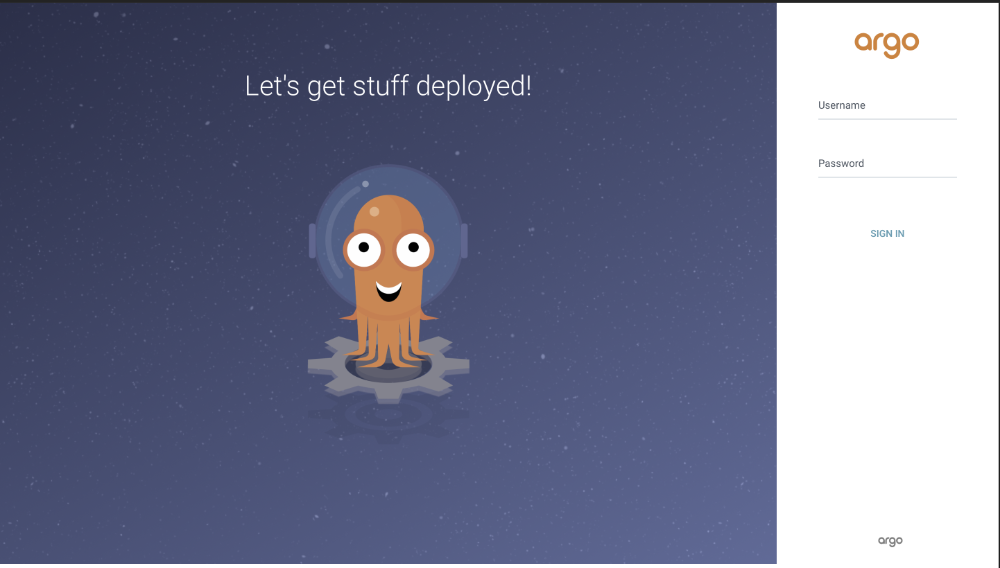
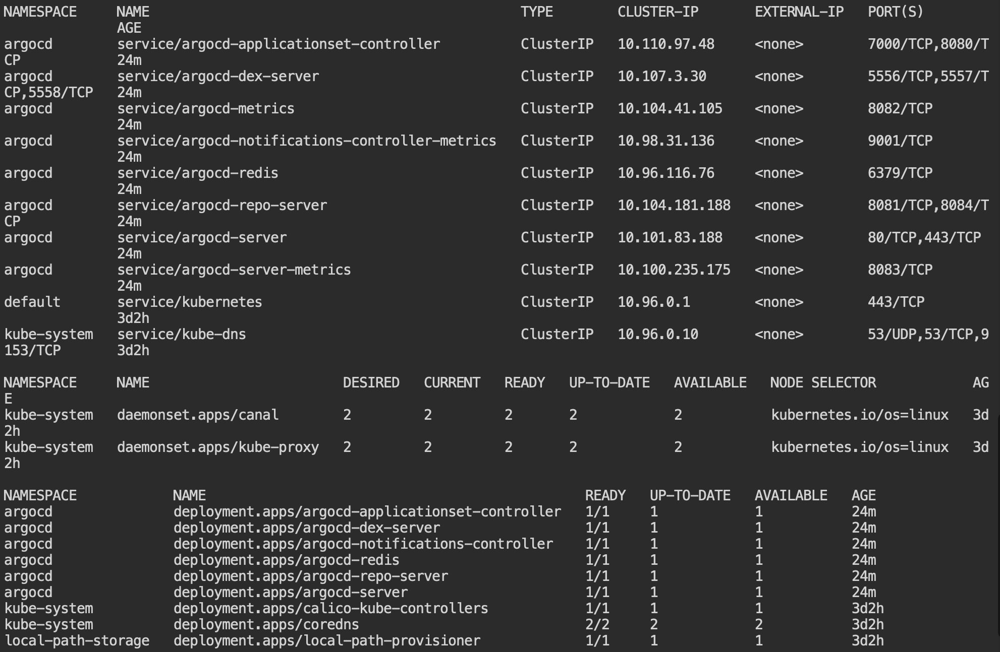
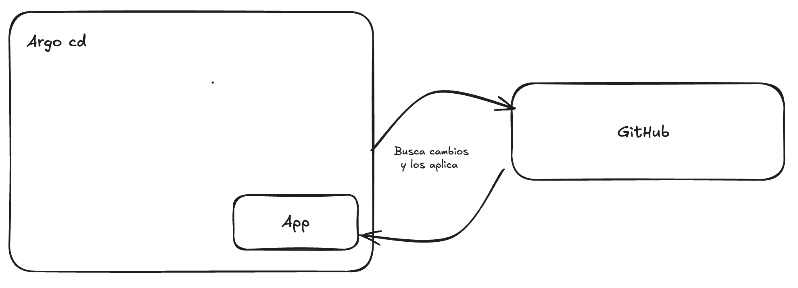

# Desafío 10 — ArgoCD en Kubernetes  

Este documento resume exactamente lo realizado:  

● Instalación de **kubectl** en el entorno de desarrollo (Killerkoda).  
● Creación del namespace `argocd`.  
● Instalación de ArgoCD con el manifiesto oficial.  
● Obtención de la contraseña inicial del usuario `admin`.  
● Solución a la incidencia `ERR_TOO_MANY_REDIRECTS` en Killerkoda mediante parche de configuración y port-forward.  
● Creación de una aplicación gestionada con ArgoCD a partir de un repositorio GitHub público.  

---

## Requisitos  

● Entorno de Kubernetes (Killerkoda / Minikube / K3s).  
● `kubectl` instalado.  
● Repositorio en GitHub con la aplicación de ejemplo (`argocd-example-apps`).  

---

## 1) Instalación de ArgoCD  

Crear el namespace:  
```bash
kubectl create namespace argocd
```

Instalar ArgoCD con el manifiesto oficial:  
```bash
kubectl apply \
   --namespace argocd \
   --filename https://raw.githubusercontent.com/argoproj/argo-cd/stable/manifests/install.yaml
```

---

## 2) Acceso inicial  

Obtener la contraseña inicial del usuario `admin`:  
```bash
kubectl -n argocd get secret argocd-initial-admin-secret -o jsonpath="{.data.password}" | base64 -d; echo
```

Hacer un port-forward del servicio de ArgoCD:  
```bash
kubectl -n argocd port-forward svc/argocd-server 8080:443
```

Acceder al dashboard desde el navegador en `https://localhost:8080`.

---

## 3) Incidencia y solución en Killerkoda  

Durante el acceso al dashboard apareció el error `ERR_TOO_MANY_REDIRECTS`.  
Para solucionarlo:  

Parchear el ConfigMap para habilitar modo inseguro:  
```bash
kubectl patch configmap argocd-cmd-params-cm -n argocd \
  --type merge \
  -p '{"data":{"server.insecure":"true"}}'
```

Reiniciar el deployment:  
```bash
kubectl rollout restart deployment argocd-server -n argocd
```

Exponer el servicio escuchando en todas las interfaces:  
```bash
kubectl port-forward --address 0.0.0.0 --namespace argocd svc/argocd-server 8080:80
```

Con esto el dashboard quedó accesible desde Killerkoda.

---

## 4) Creación de la aplicación gestionada  

Se creó un manifiesto `argocd-deployment.yaml` con el siguiente contenido:  

```yaml
apiVersion: argoproj.io/v1alpha1
kind: Application
metadata:
  name: example-deployment
  namespace: argocd
spec:
  project: default
  source:
    repoURL: 'https://github.com/lucasmleone/argocd-example-apps.git'
    targetRevision: master
    path: guestbook
  destination:
    server: 'https://kubernetes.default.svc'
    namespace: default
  syncPolicy:
    automated:
      prune: true
      selfHeal: true
    syncOptions:
      - CreateNamespace=true
```

Aplicación en Kubernetes:  
```bash
kubectl apply -f argocd-deployment.yaml
```

Resultado: el **guestbook** quedó desplegado automáticamente en el cluster bajo gestión de ArgoCD.

---

## 5) Acceso y verificación  

- Acceso al dashboard de ArgoCD: aplicación marcada como **Healthy** y **Synced**.  
- Verificación de los pods:  
```bash
kubectl get pods -n default
```
- Logs disponibles desde el dashboard o vía `kubectl logs`.  

---

## Evidencias  

#### Aplicación 


#### Dashboard de ArgoCD


#### Pantalla de Login de ArgoCD!


#### Terminal 


---

## Diagrama de alto nivel  


